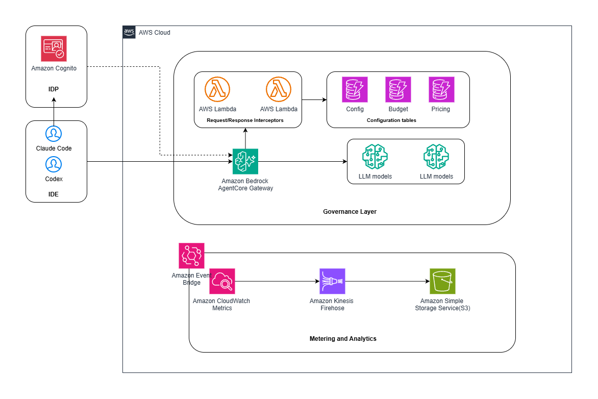

# Tokenomics

Cost governance and progressive model tiering for Bedrock-backed AI coding assistants, built on
Amazon Bedrock AgentCore Gateway and the `bedrock-mantle` inference engine.

Developers point their IDE (Claude Code, Cursor, Continue, or any OpenAI-compatible client) at a
single gateway endpoint using one **virtual model name**. Tokenomics attributes every request to
the individual developer, enforces a daily budget, and automatically downgrades the served model
through configured tiers as the budget is consumed — with a hard stop at 100%.

## Architecture



## How it works

```
IDE / portal chat  (virtual model, developer's access token)
  -> AgentCore Gateway (Cognito JWT auth; allowedClients + allowedScopes)
  -> REQUEST interceptor Lambda:
       decode JWT sub (developer) -> config + budget lookup (DynamoDB), fail-closed if unmapped
       inject the developer's own bedrock-mantle project (per-developer cost attribution)
       inject a budget_exceeded flag
       rewrite the virtual model -> the concrete model for the developer's current tier
  -> Cedar policy engine (ENFORCE):
       permit requests to the gateway; forbid when budget_exceeded (forbid wins)
  -> bedrock-mantle (routes to the resolved model; emits AWS/BedrockMantle metrics per project)
  |- GOVERNANCE: EventBridge 5-min -> Aggregator -> GetMetricData (midnight..now) per model
  |              -> $ cost (per-model pricing) -> overwrite the developer's DynamoDB budget row
  \- ANALYTICS:  Metric Stream -> Firehose -> enrich (CostCenter/Group tags) -> S3 (Athena-ready)
```

## Cost model: per-developer mantle projects

The core design decision is that **each developer gets their own permanent `bedrock-mantle`
project**, which is the unit bedrock-mantle meters cost against (its CloudWatch metrics are
dimensioned by `Project` + `Model`, with no per-user dimension).

- A **customer project** (e.g. "Platform Engineering") is **policy-only**: it holds the daily
  budget, the tier ladder, the thresholds, and the CostCenter/Group tags. It is *not* a mantle
  project (its id is `cproj_...`).
- When a developer is **assigned** to a customer project, Tokenomics creates that developer's own
  mantle project (id `proj_...`), tagged `Developer`, `Project`, `Group`, `CostCenter`, `Type`.
  All of that developer's usage meters against this project, so spend is attributed to the
  individual and rolls up to the customer project / cost center.
- **Reassigning** a developer updates the tags on their *existing* mantle project (it does not
  create a new one), so the developer's cost history stays intact across team moves.

## Components

- **Backend (CDK, native AgentCore CloudFormation):** the gateway, a `bedrock-mantle` inference
  connector target, the policy engine + two Cedar policies, Cognito (user pool + app client),
  the interceptor / enrich / aggregator / pricing-refresh / API Lambdas, a Metric Stream +
  Firehose + S3 analytics path, and DynamoDB config / budget / pricing tables.
- **Admin console (React):** configure customer projects — daily budget, allowed models, tier
  1/2/3 + thresholds, CostCenter/Group; assign and reassign developers; view per-developer usage
  rolled up per customer project, enforcement state, and alerts.
- **Developer portal (React):** developer signs in with their own credentials (in-app, no
  redirect), sees their own budget / tier / mantle project, runs a **live chat** routed through
  the gateway, and gets a copy-my-token + OpenAI base-URL helper for their IDE.
- **IDE integration:** the gateway is OpenAI-compatible; see [`docs/IDE_SETUP.md`](docs/IDE_SETUP.md).

## Project structure

```
Tokenomics/
|- cdk/
|  |- app.py
|  \- stacks/tokenomics_stack.py
|- lambdas/
|  |- gw_interceptor/       # request interceptor (per-developer mapping + model resolution)
|  |- gw_enrich/            # Firehose transform (CostCenter/Group tag enrichment)
|  |- gw_aggregator/        # 5-min governance aggregator (metrics -> $ -> budget rows)
|  |- gw_pricing_refresh/   # model catalog + pricing cache refresh
|  \- gw_api/               # backend API for the two frontends
|- frontend-admin/          # React admin console
|- frontend-portal/         # React developer portal
|- scripts/seed_demo.py     # reproducible demo data (projects + developers + budget states)
|- docs/
|  |- IDE_SETUP.md
|  \- SECURITY_ACCEPTED_RISKS.md
|- requirements.txt
|- cdk.json
\- README.md
```

## Deploy

The frontends are built into `frontend-*/dist` and the CDK stack deploys each behind its own
CloudFront distribution (the `BucketDeployment` is skipped if a `dist` folder is absent, so the
stack still synthesizes before the frontends are built).

**Prerequisites:** Python 3.11+, Node.js 20+ (Node 18 is end-of-life and triggers CDK warnings),
the AWS CDK CLI (`npm install -g aws-cdk`), and AWS credentials for the target account.

Set your target account and region once, then reuse them in every command below. The app deploys
to **any** region — substitute your own:

```bash
export ACCOUNT_ID=<your-account-id>
export REGION=<your-region>          # e.g. us-east-2, eu-west-1, ap-southeast-2
```

```bash
# 1. Bootstrap CDK in the target account/region (once per account+region; skip if already done).
cdk bootstrap aws://$ACCOUNT_ID/$REGION

# 2. Backend dependencies + deploy the stack
python -m pip install -r requirements.txt
cdk deploy TokenomicsStack --context region=$REGION --context account=$ACCOUNT_ID

# 3. Build each frontend, then redeploy so the assets ship. No .env.local needed:
#    config is injected at deploy time (see "Region/account portability" below).
(cd frontend-admin  && npm install && npm run build)
(cd frontend-portal && npm install && npm run build)
cdk deploy TokenomicsStack --context region=$REGION --context account=$ACCOUNT_ID
```

Stack outputs include `AdminUrl`, `PortalUrl`, `ApiEndpoint`, `GatewayInferenceUrl`, `UserPoolId`,
`UserPoolClientId`, and `PolicyEngineId`. Everything is region-parameterized.

### Region/account portability

The whole app deploys to **any account + region** with no hardcoded values — just
`cdk deploy --context account=<id> --context region=<region>`. Two things make the frontends
portable without a per-region rebuild:

- **Runtime config injection.** Each frontend reads its config at page load from `window.__ENV__`,
  which is served by `/env.js` — a file CDK writes into each hosting bucket from the deployed
  stack's own outputs (API URL, user pool + client id, region, gateway URL, virtual model). The
  built bundle carries no account/region values, so one build runs anywhere. (`import.meta.env`
  Vite vars are still read as a fallback for local `npm run dev`.)
- **CloudFront OAC names are region-scoped.** CloudFront is a global service, so the Origin Access
  Control names are suffixed with the region (`tokenomics-*-oac-<region>`) to avoid cross-region
  `AlreadyExists` collisions when the same stack is deployed to a second region in one account.

First-time deploy in a new region: the model catalog (Pricing table) is populated by the
`PricingRefresh` Lambda, which runs daily at 01:00 UTC. On a fresh region, invoke it once (admin
console **Refresh models**, or `aws lambda invoke --function-name Tokenomics-PricingRefresh-$REGION
--region $REGION /dev/null`) so the admin model dropdowns and the seed have a catalog to work from.

### Seed the demo data

`cdk deploy` provisions empty infrastructure. To light up the full governance story (customer
projects with cross-family tier ladders, developers with their own mantle projects, and budget
states spanning healthy / warning / critical / blocked), run the seed script after deploy:

```bash
# Passwords are read from env vars (never hardcoded) or an uncommitted scripts/.env.local
# (copy scripts/.env.local.example). Both are REQUIRED, must be >= 12 chars, and must differ
# (the admin credential is deliberately separate from the developer one). The seed refuses to
# run until both are set.
export TOKENOMICS_DEMO_PASSWORD='choose-a-demo-password'              # the demo developer accounts
export TOKENOMICS_ADMIN_PASSWORD='choose-a-different-admin-password'  # the demo admin account
python scripts/seed_demo.py --region $REGION
```

The script is idempotent. Note that the aggregator recomputes budgets every ~5 minutes from live
CloudWatch metrics and will overwrite the seeded values (to `$0` when there is no real traffic),
so run it shortly before a demo, or use real developer traffic instead (`--no-budget`).

## Using it from an IDE (or the portal chat)

The gateway is an OpenAI-compatible endpoint. Point any OpenAI-compatible client at it:

- **Base URL:** `<GatewayInferenceUrl>/v1` (e.g. `https://<gw-id>.gateway.bedrock-agentcore.<region>.amazonaws.com/inference/v1`)
- **Model:** `team-coding-model` (the virtual model; the gateway resolves the real one by tier)
- **API key:** the developer's Cognito **access token** (the portal's *Copy my token* button)

Full per-IDE instructions (Claude Code, Cursor, Continue, OpenAI SDK, curl) are in
[`docs/IDE_SETUP.md`](docs/IDE_SETUP.md).

## Model API formats and gateway routes

Not every model speaks the same wire protocol, and the AgentCore gateway exposes **three
different inference routes** under `/inference` — one per API shape. A request only succeeds when
the model is sent to the route that serves its family; sending a model to the wrong route returns
`HTTP 400 "model \`<id>\` isn't supported on this route"`. This is a real constraint that shaped
both the developer portal and the demo seed.

| Route (path under `/inference`) | API shape | Model families that serve here |
| --- | --- | --- |
| `/v1/chat/completions` | OpenAI **Chat Completions** (`messages[]` → `choices[].message.content`) | Open-weight families: `deepseek.*`, `qwen.*`, `mistral.*`, `google.gemma*`, `meta.*`, `nvidia.*`, `zai.*`, **and `openai.gpt-oss-*`** |
| `/v1/messages` | **Anthropic Messages** (`messages[]` + `system`, `anthropic-version` header → `content[].text`) | `anthropic.claude-*` |
| `/v1/responses` | OpenAI **Responses API** (single `input` → `output_text`) | Proprietary `openai.gpt-5.*` (and other `openai.gpt-*` / `openai.o*`) |

Key, non-obvious point: **`openai.gpt-oss-*` and `openai.gpt-5.*` are NOT interchangeable.** The
open-weight `gpt-oss` models serve on Chat Completions, but the proprietary GPT-5.x models are
served **only** via the Responses API — verified live against the deployed gateway
(`openai.gpt-5.4` → 400 on `/v1/chat/completions`; `openai.gpt-oss-120b` → 200). This matches the
AWS docs: [GPT-5.x on `bedrock-mantle`](https://docs.aws.amazon.com/bedrock/latest/userguide/bedrock-mantle.html)
is accessed through the Responses API. Similarly, `xai.grok-*` is not accepted on the Chat
Completions route.

### How Tokenomics handles this

- **Developer portal (tri-route).** The portal chat implements **all three** routes — Chat
  Completions, Anthropic Messages, and the OpenAI Responses API — and picks the route from the
  *concrete tier model* the gateway will serve (computed client-side from the budget tier ladder),
  not from the requested virtual alias. Proprietary GPT-5.x models use the Responses API
  (`/v1/responses` with `input` array, `output_text` response); open-weight/gpt-oss use Chat
  Completions; Anthropic Claude uses Messages. All three response shapes are normalized to the
  same `{content, usage}` structure, so cache-token lines (`cache_read_input_tokens` /
  `cache_creation_input_tokens`) and standard usage surface uniformly regardless of provider.
- **Route selection lives in the client, not the interceptor.** The request interceptor rewrites
  the `model` field (to the budget-tier model) and sets the per-route attribution header, but it
  cannot change the URL path the client called. Route correctness therefore depends on the client
  sending each model family to its matching path — which is why the portal derives the route from
  the resolved tier model.
- **Seed data is route-aware and catalog-driven.** `scripts/seed_demo.py` reads the region's live
  model catalog (the Pricing table, populated from `mantle GET /v1/models`) and classifies each
  model by route (`_classify_route`). It builds OpenAI-route tier ladders (open-weight + gpt-oss)
  for most projects and one all-`anthropic.claude-*` project, and **excludes** Responses-API-only
  and unsupported families (`openai.gpt-5.*`, `openai.gpt-4*`, `openai.o*`, `xai.*`) so a seeded
  developer never lands on a model that 400s in the portal. No model ids are hardcoded, so the
  seed is portable to any account/region.

## Authentication & security

Developers authenticate in-app with their own Cognito credentials (username + password, no Hosted
UI redirect). The gateway's JWT authorizer accepts the in-app access token as the outer gate
(restricted to this user pool's app client). The real per-developer authorization happens inside
the request path: the interceptor maps the token's `sub` to the developer's project/budget/tier
and fails closed for any unmapped identity, and the Cedar policy engine blocks over-budget
requests. The design stays IdP-agnostic for production (Cognito / Okta / IAM Identity Center).

Security posture, scanner results, and the documented accepted risks (including the access-token
scope trade-off and its production hardening alternative) are in
[`docs/SECURITY_ACCEPTED_RISKS.md`](docs/SECURITY_ACCEPTED_RISKS.md). A ProtoShield scan of the
source tree reports no findings across IAM least-privilege, Semgrep, secrets, Checkov, CDK NAG,
and dependency CVEs, with 100% Apache-2.0 license-header coverage.

## License

Apache-2.0. See [`LICENSE`](LICENSE) and [`NOTICE`](NOTICE).
```
